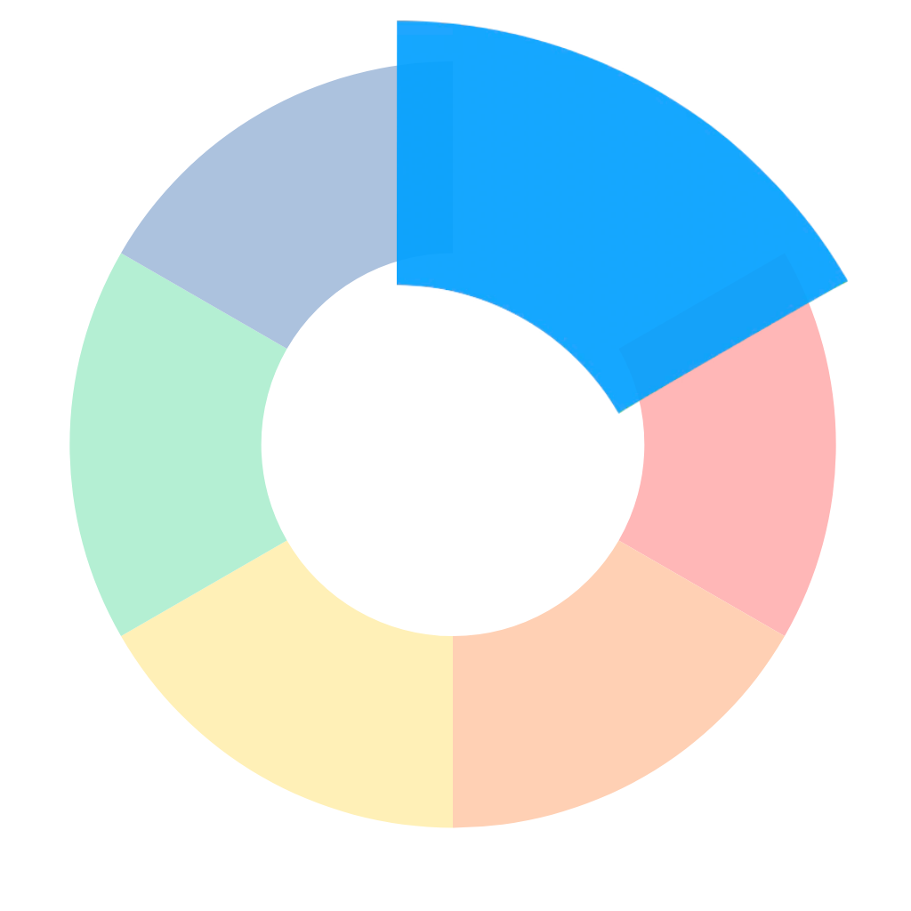
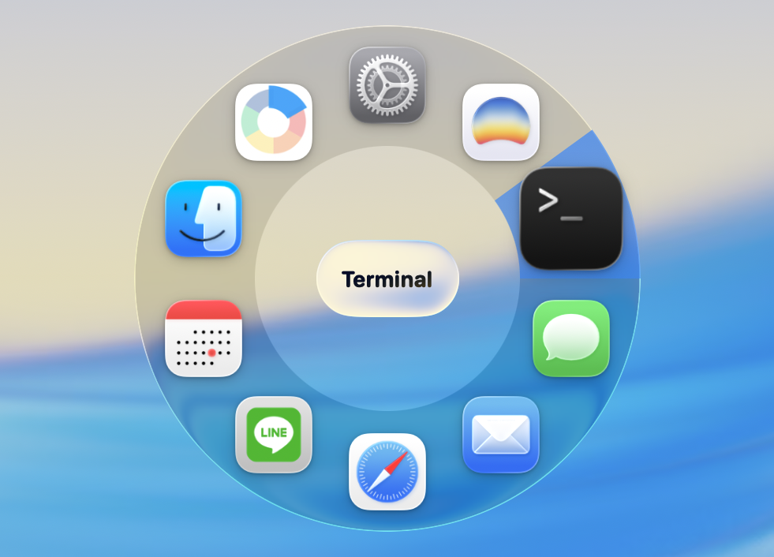

<h1 align="center">





AppSwitcher


</h1>

<p align="center">


</p>

Say hello to AppSwitcher, the most fluid way to navigate your macOS workspace! Forget about the traditional, static Cmd + Tab—AppSwitcher transforms your window switching into a dynamic, circular liquid glass experience. Featuring a vibrant frosted visualizer and intuitive gesture-like controls, it’s like having a futuristic command center right under your fingertips!

<p align="center">

</p>

# 🚀 Installation

### 🛠️ Manual Installation

1. Download the latest release from the [Releases](https://www.google.com/search?q=https://github.com/liaoyork/appswitcher/releases) page.
2. Unzip and drag `AppSwitcher.app` into your `/Applications` folder.
3. **Important for first-time launch:** Since the app is not notarized, right-click (or Control-click) the app icon and select **close**, not move to trash  
   a. go to **Setting** -> **Privacy and Security**  
   b. scroll down to the **Security**  
   c. click **Open anyway**  
   d. Use the password or fingerprint to authorize the application
   

### 🍺 Via Homebrew (Recommended)
The fastest way to install and keep AppSwitcher updated. Using the `--no-quarantine` flag allows you to skip the manual security approval steps.

```bash
brew install --cask liaoyork/tap/appswitcher

```

If you want to skip these tedious steps, you can use the following command.  

```bash
brew install --cask liaoyork/tap/appswitcher --no-quarantine

```
   
### 💻 System Requirements

* **macOS:** 26 tahoe or later
* **Architecture:** Apple Silicon (M1/M2/M3) or Intel Mac.


# ✨ Usage
+ Activate: Hold Option + Command + tab to reveal the liquid glass ring.

+ Switch: Hover over any app icon to see the sector highlight, then release the keys to switch.

+ Customize: Open the Menu Bar icon and select Settings... to fine-tune your experience.

# 📋 Roadmap
   [V] Liquid Glass UI (Vibrant Frosted Effect)

   [V] Circular Layout (Up to 12 apps)

   [V] Option + Control Global Trigger

   [V] Adjustable Ring Radius

   [V] Launch at Login (via SMAppService)

   [V] Shared Configuration (Non-Sandboxed Data Sync)

   [V] Customizable Hotkeys 👆🏻

   [ ] App Exclusion List 🚫

   [ ] Visualizer Color Themes 🎨

# 🛠 Technical Highlights
<h2 align="center">
  

User Interface

</h2>

+ Active-State Rendering: Forces NSVisualEffectView into an .active state to maintain high-clarity vibrancy.

+ Circular Layout Engine: Dynamically calculates icon positioning using polar coordinates, supporting up to 12 concurrent applications with precise hover-tracking.

+ High-Priority Overlays: Utilizes the .screenSaver window level to ensure the switcher remains visible above full-screen apps and system-level overlays.  

+ Global Event Monitoring: Implements a low-level event monitor for the Option + Control trigger, ensuring reliable global activation without focus dependencies.

+ Modern Service Management: Leverages SMAppService for robust, modern "Launch at Login" functionality.
